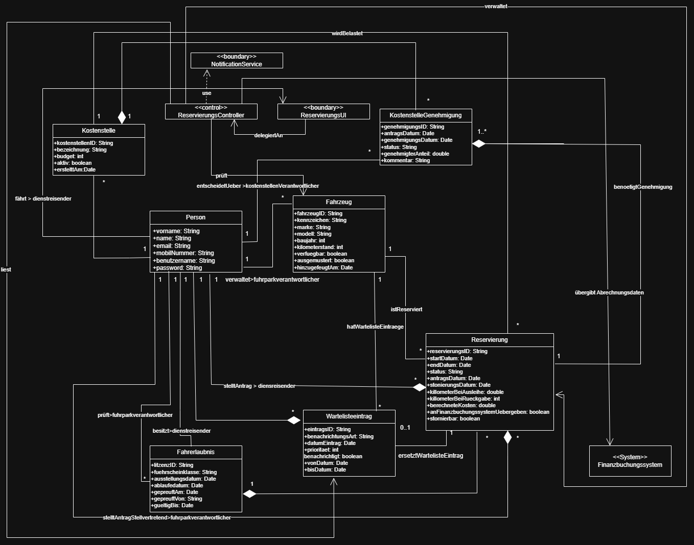

# 🚗 HSCOCAR - Fuhrparkmanagementsystem (UML-Architektur)

Dieses Repository enthält die Konzeption und vollständige UML-Modellierung für "HSCOCAR", ein softwaregestütztes Fuhrparkmanagementsystem. 
Das Projekt entstand im Rahmen des Moduls "Software Engineering" an der Hochschule Coburg und wurde mit der Bestnote (**29 von 30 Punkten**) bewertet.

**Autor:** Ahmad Al-Rifai

## 📋 Projektbeschreibung
Das System digitalisiert und automatisiert den Reservierungsprozess von Dienstfahrzeugen. Die modellierte Softwarearchitektur deckt komplexe Prozesse ab, darunter:
* Verwaltung von Reservierungen inkl. intelligenter Wartelisten-Logik (E-Mail/SMS-Benachrichtigungen).
* Genehmigungsworkflows über spezifische Kostenstellen.
* Erfassung von Fahrzeugausgabe und -rückgabe.
* Schnittstellenkonzeption zu einem externen Finanzbuchungssystem zur Kostenabrechnung.

## 📐 Erstellte UML-Modelle
Die Architektur wurde vollständig objektorientiert entworfen und umfasst:
* **Use-Case-Diagramm:** Definition der Akteure (Dienstreisende, Fuhrpark- und Kostenstellenverantwortliche) und Kernanwendungsfälle.
* **Aktivitätsdiagramm:** Detaillierte Ablauflogik inkl. Ausnahmeszenarien (z.B. Fehler bei Stornierungen).
* **Klassendiagramm:** Fundiertes Datenmodell (Entitäten wie Fahrzeuge, Kostenstellen, User).
* **Zustandsdiagramm:** Abbildung des Lebenszyklus einer Fahrzeugreservierung.
* **Sequenzdiagramm:** Modellierung der internen Objektkommunikation und Systemabläufe.

## 📊 Architektur-Einblick

*(Hinweis: Damit das Bild hier angezeigt wird, muss die Datei exakt `uml-preview.png` heißen und im Repository liegen).*

## 📂 Vollständige Dokumentation
Die detaillierten und hochauflösenden Diagramme aller Systemkomponenten befinden sich in der angehängten **PDF-Datei** in diesem Repository.
